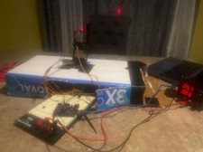
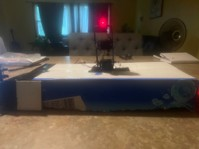
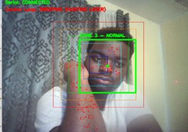
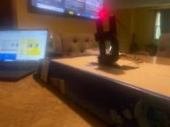
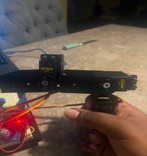
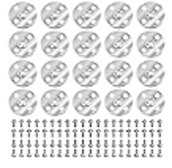
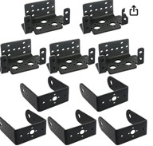
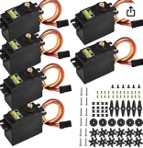

# Autonomous Face-Tracking Laser Turret

By **Jayden Ankrah** — Robotics Engineering, University of Connecticut

A pan-tilt turret that uses a webcam and OpenCV to find a face, then drives three servos to point a laser at it in real time. When no face is in frame, the turret sweeps on its own until it finds one.

📄 Full project writeup / slides: [`Robotics_presentation_final22.pdf`](Robotics_presentation_final22.pdf)


---

## What It Does

- A webcam feeds live video into Python, where OpenCV detects the face and locates the laser dot.
- Python calculates the gap between the face center and the laser, then sends correction values to the Arduino over USB serial.
- The Arduino drives 3 servos via PWM to close that gap, while toggling the laser on pin 12 for detection.
- When no face is found, the turret sweeps autonomously until one appears.

## Hardware Stack

| Layer | Component |
|---|---|
| Vision | Webcam (OpenCV / Python) |
| Controller | Arduino Uno |
| Actuation | 3x MG996R Servos (pins 9, 10, 11) |
| Targeting | Red Laser Module (pin 12) |
| Interconnect | USB Serial / PWM signals / Digital GPIO |




## How It Was Built

- Built as a pan-tilt-tilt rig: one motor handles left/right, and two more motors handle up/down independently of each other.
- Powered from a dedicated battery station, since the turret is a stationary machine.
- The Arduino sits on a breadboard for shared power and connections, and is tethered to a laptop for uploading code.



## How It Works

**Sweep Mode** (no face locked):
1. Pan servo sweeps across the frame.
2. Each frame is checked for a face.
3. If a face is detected → switch to Track Mode. If not → loop back and keep sweeping.

**Track Mode** (face locked):
1. Blink the laser off, then on.
2. Subtract the two frames to isolate the laser dot regardless of background.
3. Compute the offset between the face center and the laser position.
4. Send a correction to the Arduino to move the motors.
5. If the face is lost, return to Sweep Mode.

## Challenges & Solutions

### 1. Laser detection failed on dark skin tones
The original approach used HSV color filtering to isolate red pixels — but red undertones in skin caused false locks, and dark hair absorbed the laser too well for the reflection to register reliably.

**Fix:** Rewrote the detection logic to blink the laser off/on and subtract the two frames. This isolates the laser by change-in-brightness rather than raw color, so it works regardless of skin tone or surface. As a physical backstop, wearing a hat over hair (which otherwise absorbs the laser) also reduced false negatives.




### 2. No access to a 3D printer for the mounting base
The UConn Library 3D printing lab was closed on the only day it was available, so the designed servo base couldn't be printed and the turret had no rigid mount.

**Fix:** Built a cardboard base instead, which was enough to mount the full turret rigidly.


## Live Demo

Turret sweeps autonomously → face detected, tracking starts → laser corrects toward face center → head moves, turret follows.

Known issue: minor tracking bugs around sideburns/beard edges.




**Videos:**

- [`demo-laser-tracking-face.mp4`](media/demo-laser-tracking-face.mp4) — laser locking onto and following a face in real time.
- [`demo-vision-loop-screen-recording.mp4`](media/demo-vision-loop-screen-recording.mp4) — screen capture of the OpenCV vision loop, showing zone tracking and laser detection overlays.
- [`demo-full-desk-setup.mp4`](media/demo-full-desk-setup.mp4) — full setup view: turret, Arduino, and laptop running the control loop together.

## Parts List (~$120 total)

- METERXITY 10-Pack MF83ZZ Flanged Ball Bearing
- DaFuRui 20Pcs Servo Horn Metal Aluminum 25T Silvery Servo Disc
- 3x8x3mm Steel Deep Groove Ball Bearing (Pack of 10)
- DaFuRui 5 Sets Pan Tilt Servo Mount Bracket (MG995/MG996R/S3003)
- Aideepen 6-Pack MG996R Metal Gear High Speed Torque Digital Servo
- 100pcs M3 x 6mm Hex Socket Head Cap Screws
- HiLetgo 5pcs DC 5V Laser Transmitter Module (650nm)

Cost would have been higher without already having electronics on hand to power and connect the motors.





## References

Learning materials from O'Reilly Learning (free for UConn students):

<table>
<tr>
<td><br><b>Arduino Cookbook</b><br>Michael Margolis</td>
<td><br><b>Learning OpenCV 3</b><br>Bradski & Kaehler</td>
<td><br><b>Computer Vision with Python</b><br>Jan Erik Solem</td>
</tr>
<tr>
<td><br><b>Make: Electronics</b><br>Charles Platt</td>
<td><br><b>Getting Started with Arduino</b><br>Massimo Banzi</td>
<td></td>
</tr>
</table>

- **Arduino Cookbook** — servo control, serial communication, digital pin output.
- **Learning OpenCV 3** — contour detection, image thresholding, HSV masking.
- **Programming Computer Vision with Python** — frame differencing, blob detection, camera calibration.
- **Make: Electronics** — laser modules, transistors, digital GPIO at the circuit level.
- **Getting Started with Arduino** — PWM, servo libraries, serial protocol.

---

## Repo Structure

```
.
├── README.md
├── Robotics_presentation_final22.pdf   # full project slides/writeup
├── media/              # build photos, parts, book covers, and demo videos
└── src/                # (add) Arduino .ino and Python tracking scripts
```

## Questions?

Reach out — Jayden Ankrah, Robotics Engineering, University of Connecticut.
